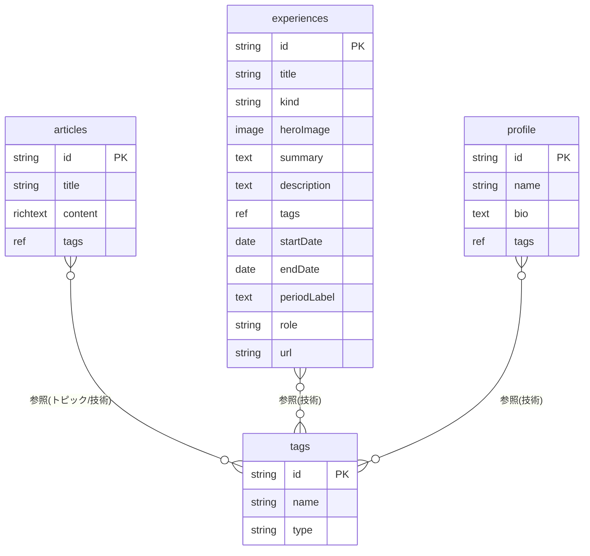

# DB設計（microCMS コンテンツモデル）

デザイン `design/New-ui.pen` の各画面から必要なデータを起こしたもの。

## API（エンドポイント）一覧

| API | 形式 | 用途 | 対応画面 |
|---|---|---|---|
| `articles` | リスト | ブログ記事 | Article List / Search / 記事詳細 |
| `tags` | リスト | トピック・技術の共通マスタ（`type`で区別） | 記事のタグ、実績の技術スタック、Profileの技術 |
| `experiences` | リスト | 制作物・インターン・ハッカソン等の実績 | Service Detail / ServiceCard / Profile のTimeline |
| `profile` | **単一オブジェクト** | Profile上部（名前・Bio・技術スタック） | Profile Page |

## 設計上のポイント

### tags（トピックと技術を1マスタに統合）
トピック（`備忘録` `設計` `デザイン`など）と技術（`Next.js` `React`など）を**2つに分けず、1つの `tags` マスタ**にまとめ、各レコードの `type`（`トピック` / `技術`）で仕分ける。

- 同じ語が2箇所に存在しないので**重複・二重管理が原理的に起きない**
- 記事・実績・プロフィールすべてが**同じマスタを複数参照**するので、`Next.js` で横断検索できる
- 「技術だけ」「トピックだけ」の絞り込みは `type` でフィルタ
- 各APIの参照フィールドは「登録済みレコードから選択」になるため、入稿時に自由入力で変な値を紛れ込ませることはできない（マスタ管理のみ運用で担保）

### experiences（制作物・インターン・ハッカソン等を統合）
制作物・インターン・ハッカソンなど各種の実績を1つのAPIにまとめ、`kind`（種別）で区別する。名前は意味の破綻を避けるため中立の `experiences`。

**「種類」と「表示するか」は別軸として持つ。**
- `kind`（セレクト） … それが何か（`制作物` / `インターン` / `ハッカソン` …）。ラベルや詳細表示に使う。
- 表示するか … **`description`（本文）が入っているか**で判定する。専用のフラグは持たない。

こうすることで「載せたい種類が増えても条件が膨らまない」「詳細を書いたものだけ自然に表に出る」を両立できる。`kind`でフィルタする方式は、種類が増えるたびに条件が `制作物 OR ハッカソン …` と膨らみ破綻するため採らない。

- **Profile** … `experiences` を**全件**、`startDate` 昇順でTimeline表示
- **Service一覧・Home本棚** … `description`（本文）が**入っているものだけ**を**フィルタ**表示（`kind`は問わない）
- 詳細ページは `description` が持つ（インターン等、本文を書かないものはService一覧・本棚に出ず、ProfileのTimelineにだけ載る）
- ※ 「制作物のときだけ必須」のような条件付き必須は microCMS 標準では不可のため、必須制御は設けない

### 日付の持ち方（startDate と periodLabel）
「並び替え」と「表示」は別物として持つ。

- `startDate`（date・必須） … **開始日。並び替えの基準であり、日付表示の起点**。Timelineはこれでソートする。年月単位で足りる実績は日を `01` 固定で登録してよい。microCMS標準のソート／日付フィルタがそのまま効く。
- `endDate`（date・任意） … 終了日。`startDate 〜 endDate` の期間表示に使う。入れるかは任意で、**空でも「進行中」を意味しない**（単に終了日を記録しないだけ）。進行中を示したいときは `periodLabel` に `〜現在` と書く。
- `periodLabel`（text・任意／空欄可） … 上記の日付の**隣に添える一言の補足**。日付そのものの代わりではない（例：`約2週間` / `（開発中）`）。不要なら空欄でよい。

→ 並び順は `startDate`（date）が担保し、期間は `startDate`/`endDate`、補足は `periodLabel` で添える。string での日付表記は表記ゆれ・ソート不安定のため使わない。

### 本棚（ShelfBook / ShelfNote） - HomePage
`articles` や `experiences`（`description` あり）を並べて見せる**ビュー**なので、専用データは持たない。

## ER図

エンティティ・関連・主要フィールドのみを示す。型・必須などの詳細は後述の「フィールド定義」を参照。

## フィールド定義

必須/任意・型はER図ではなくこの表に集約する（表に載っている＝仕様が確定している）。

### articles

| フィールド | 型 | 必須 | 説明 |
|---|---|---|---|
| `title` | text | ✓ | 記事タイトル |
| `content` | richtext | ✓ | 本文 |
| `tags` | 複数参照(tags) | ✓ | トピック＋技術。`#` 表示 |

※ microCMS標準の `id` / `publishedAt` / `updatedAt` は自動付与のため上表には含めない。並び順や「新着」表示は `publishedAt` を利用。
※ 一覧カード・検索・SEO用に **`eyecatch`（image）/ `description`（text 抜粋）/ `slug`（text）** の追加を要検討（デザインの一覧・検索画面で必要になる想定）。

### tags
| フィールド | 型 | 必須 | 説明 |
|---|---|:---:|---|
| `name` | text | ✓ | 使用する名称 |
| `type` | select(`技術` / `トピック`) | ✓ | 仕分け用。未設定だと横断検索から漏れるため必須 |

### experiences
| フィールド | 型 | 必須 | 説明 |
|---|---|:---:|---|
| `title` | text | ✓ | 実績のタイトル |
| `kind` | select(`制作物` / `インターン` / `ハッカソン` …) | ✓ | 経験の種類。ラベル・詳細表示に使う |
| `summary` | text | | 一言解説（カード・冒頭に出す短い説明）。`description`とは別 |
| `description` | text | | 開発の詳細（本文） |
| `heroImage` | image | | 詳細ページ上部のメインビジュアル画像 |
| `tags` | 複数参照(tags) | | 技術スタック |
| `startDate` | date | ✓ | 開始日。並び替えの基準 |
| `endDate` | date | | 終了日。期間表示に使う |
| `periodLabel` | text | | 上記の日付の隣に添える一言（`約2週間` / `（現在開発中）` など・空欄可） |
| `role` | text | | 役割 |
| `url` | text | | 外部リンク |

### profile（単一オブジェクト・1件のみ）
| フィールド | 型 | 必須 | 説明 |
|---|---|:---:|---|
| `name` | text | ✓ | |
| `bio` | text | ✓ | |
| `tags` | 複数参照(tags) | | 技術スタック |

## microCMS実装メモ
- 多対多はすべて**複数参照フィールド**で表現（`articles→tags`、`experiences→tags`、`profile→tags`）。中間テーブルは作らない。
- `tags.type` はセレクトフィールド（`技術` / `トピック`）。**必須**にしてtype無しタグの混入を防ぐ。
  - 記事タグ表示 … `articles.tags` をそのまま `#` 表示（トピック・技術どちらも）
  - 記事の技術横断検索 … `tags`（`type=技術`）で `articles` と `experiences` を横断
  - 実績・プロフィールの技術表示 … 参照した `tags` のうち `type=技術` を表示
- `tags` 参照は「登録済みから選択」のため記事側の自由入力は不可。マスタへの不正な語の登録だけ運用ルールで防ぐ。
- `experiences.kind` はセレクトフィールド（`制作物` / `インターン` / `ハッカソン` など）。種類はラベル・詳細表示に使い、**表示制御には使わない**。
- 表示制御は `experiences.description`（本文）の有無に一本化。Service一覧・Home本棚は `description` が入っているものだけのフィルタビュー。`kind`が増えてもフィルタ条件は変わらない。
- `experiences` の日付は `startDate`（date・必須／並び替え基準）と `endDate`（date・任意／空でも進行中の意味ではない）で期間を表し、`periodLabel`（text・任意）はその隣に添える一言の補足（進行中は `〜現在` などと記す）。
- `profile` は「オブジェクト形式」で作成（リストにしない）。
