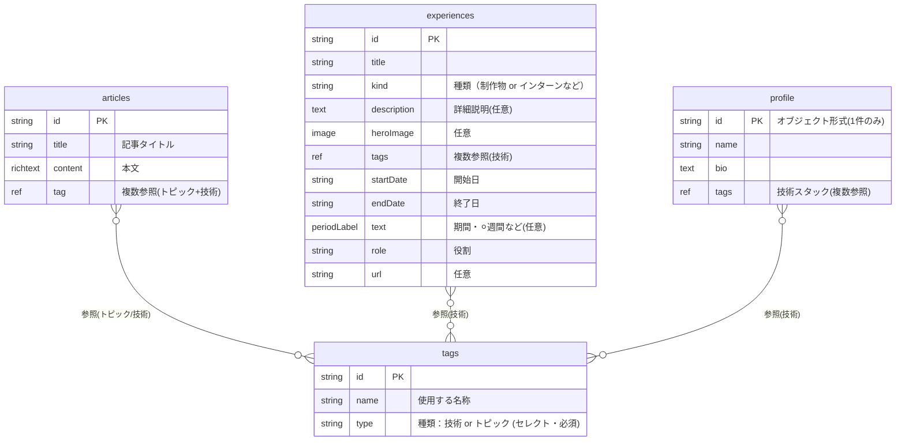

# DB設計（microCMS コンテンツモデル）

デザイン `design/New-ui.pen` の各画面から必要なデータを起こしたもの。

## API（エンドポイント）一覧

| API | 形式 | 用途 | 対応画面 |
|---|---|---|---|
| `articles` | リスト | ブログ記事 | Article List / Search / 記事詳細 |
| `tags` | リスト | トピック・技術の共通マスタ（`type`で区別） | 記事のタグ、実績の技術スタック、Aboutの技術 |
| `experiences` | リスト | 制作物・インターン等の実績 | Service Detail / ServiceCard / About のTimeline |
| `profile` | **単一オブジェクト** | About上部（名前・Bio・技術スタック） | About Page |

## 設計上のポイント

### tags（トピックと技術を1マスタに統合）
トピック（`SEO` `設計` `UX`）と技術（`Next.js` `React`）を**2つに分けず、1つの `tags` マスタ**にまとめ、各レコードの `type`（`トピック` / `技術`）で仕分ける。

- 同じ語が2箇所に存在しないので**重複・二重管理が原理的に起きない**
- 記事・実績・プロフィールすべてが**同じマスタを複数参照**するので、`Next.js` で横断検索できる
- 「技術だけ」「トピックだけ」の絞り込みは `type` でフィルタ
- 各APIの参照フィールドは「登録済みレコードから選択」になるため、入稿時に自由入力で変な値を紛れ込ませることはできない（マスタ管理のみ運用で担保）

### experiences（制作物とインターンを統合）
「制作物」と「インターン」を1つのAPIにまとめ、`kind`（種別）で区別する。名前は意味の破綻を避けるため中立の `experiences`。

- **About** … `experiences` を**全件**、`startDate` 降順でTimeline表示
- **Service一覧** … `kind = 制作物` で**フィルタ**して表示
- 詳細ページは `experiences` が持つ（インターン等は詳細項目を任意で空にできる）
- ※ 「制作物のときだけ必須」のような条件付き必須は microCMS 標準では不可のため、必須制御は設けない

### 本棚（ShelfBook / ShelfNote）
`articles` や `experiences` を並べて見せる**ビュー**なので、専用データは持たない。

## ER図

## microCMS実装メモ
- 多対多はすべて**複数参照フィールド**で表現（`articles→tags`、`experiences→tags`、`profile→tags`）。中間テーブルは作らない。
- `tags.type` はセレクトフィールド（`技術` / `トピック`）。
  - 記事タグ表示 … `articles.tags` をそのまま `#` 表示（トピック・技術どちらも）
  - 記事の技術横断検索 … `tags`（`type=技術`）で `articles` と `experiences` を横断
  - 実績・プロフィールの技術表示 … 参照した `tags` のうち `type=技術` を表示
- `tags` 参照は「登録済みから選択」のため記事側の自由入力は不可。マスタへの不正な語の登録だけ運用ルールで防ぐ。
- `experiences.kind` はセレクトフィールド（`制作物` / `インターン` など）。Service画面は `kind=制作物` のフィルタビュー。
- `profile` は「オブジェクト形式」で作成（リストにしない）。
